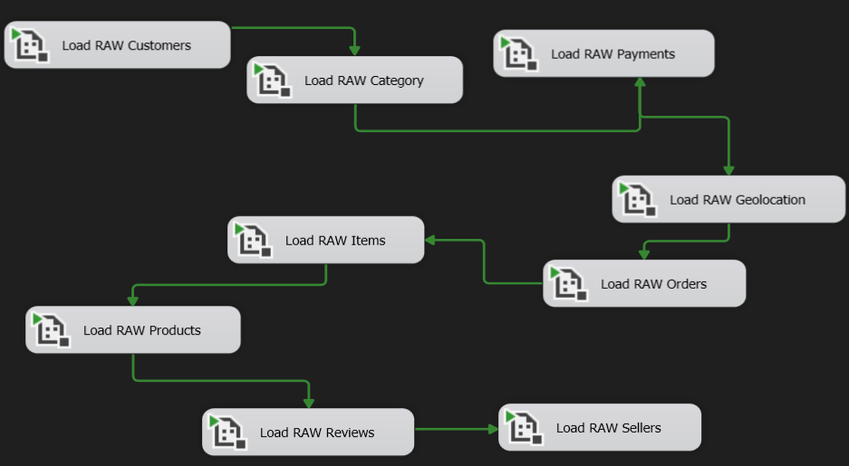

# 🏗️ Ecommerce Data Warehouse & BI

Solución end-to-end de Data Warehouse y Business Intelligence para análisis de e-commerce, utilizando SQL Server, SSIS y Power BI.

---

## 📌 Arquitectura del Proyecto

<p align="center">
  
</p>

El proyecto implementa una arquitectura multicapa orientada al procesamiento y análisis de datos:

- **RAW** → almacenamiento inicial de datos
- **STAGING** → tipificación y estandarización
- **PROCESSING** → validaciones y reglas de negocio
- **MART** → modelo analítico para BI
- **POWER BI** → visualización y análisis

---

## ⚙️ Tecnologías Utilizadas

<p align="center">


</p>

---

## 🔄 Flujo ETL

### 1️⃣ Extracción
- Ingesta de archivos CSV mediante SSIS
- Carga inicial hacia capa RAW

### 2️⃣ Transformación
- Estandarización de datos
- Conversión de tipos de datos
- Validaciones de calidad
- Aplicación de reglas de negocio

### 3️⃣ Consolidación
- Construcción de tablas dimensionales
- Generación de tablas fact
- Consolidación analítica en MART

---

## 🗂️ Estructura del Proyecto

```text
Ecommerce-DataWarehouse-BI/
│
├── assets/
├── database/
├── etl/
├── powerbi/
├── docs/
├── README.md
└── LICENSE
```

---

## 🧩 Modelado de Datos

El proyecto utiliza una arquitectura analítica basada en:

- Tablas de dimensiones
- Tabla de hechos
- Modelo estrella (Star Schema)

---

## 📊 Dashboards Power BI

### 📈 Dashboard de Ventas

<p align="center">
  
</p>

---

### 👥 Dashboard de Clientes

<p align="center">
  
</p>

---

### 💰 Dashboard de Rentabilidad

<p align="center">
  
</p>

---

## 🔧 Pipeline SSIS

<p align="center">
  
</p>

---

## 🚀 Componentes Principales

- SQL Server Database
- SSIS ETL Pipeline
- Data Warehouse multicapa
- Procesos de transformación
- Modelo dimensional
- Dashboards interactivos en Power BI

---

## 📄 Documentación

📘 La documentación técnica completa del proyecto se encuentra disponible aquí:

<p align="center">
  <a href="./assets/project_documentation.pdf">
    
  </a>
</p>

---

